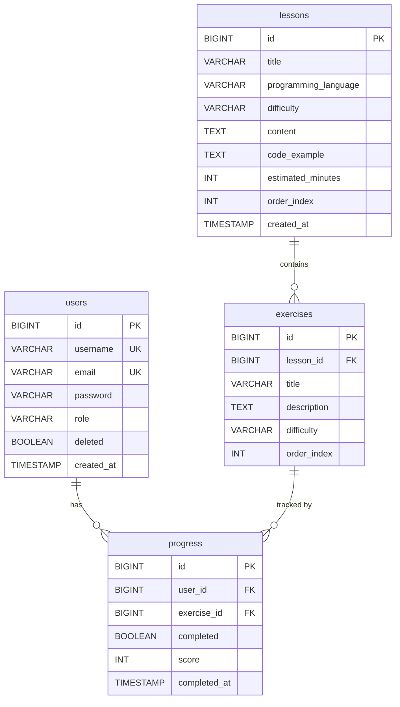

# JavaJolt — Entity Relationship Diagram

```mermaid
erDiagram
    users {
        BIGINT id PK
        VARCHAR username UK
        VARCHAR email UK
        VARCHAR password
        VARCHAR role
        BOOLEAN deleted
        TIMESTAMP created_at
    }

    lessons {
        BIGINT id PK
        VARCHAR title
        VARCHAR programming_language
        VARCHAR difficulty
        TEXT content
        TEXT code_example
        INT estimated_minutes
        INT order_index
        TIMESTAMP created_at
    }

    exercises {
        BIGINT id PK
        BIGINT lesson_id FK
        VARCHAR title
        TEXT description
        VARCHAR difficulty
        INT order_index
    }

    progress {
        BIGINT id PK
        BIGINT user_id FK
        BIGINT exercise_id FK
        BOOLEAN completed
        INT score
        TIMESTAMP completed_at
    }

    users ||--o{ progress : "has"
    lessons ||--o{ exercises : "contains"
    exercises ||--o{ progress : "tracked by"
```
