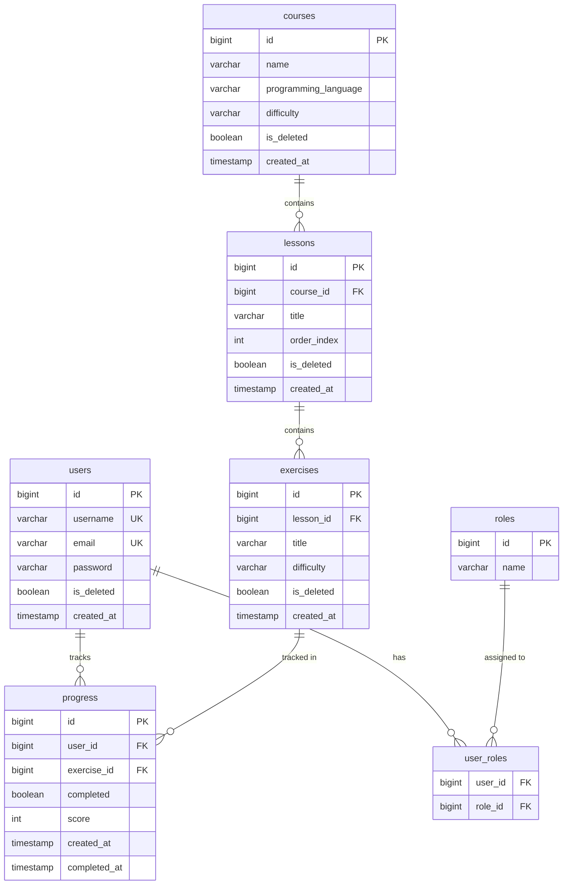

# JavaJolt — Entity Relationship Diagram

## Relationships

- **users ↔ roles** — Many-to-many via `user_roles` join table. A user can have multiple roles (USER, ADMIN). A role can belong to many users.
- **courses → lessons** — One-to-many. A course contains many lessons ordered by `order_index`.
- **lessons → exercises** — One-to-many. A lesson contains many exercises.
- **users ↔ exercises** — Many-to-many via `progress`. Each progress row tracks one user's completion of one exercise, including score and timestamp.

## Design Decisions

- All entities except `roles` and `user_roles` carry an `is_deleted` flag for soft delete — data is never permanently removed.
- `password` stores a BCrypt hash — plain text is never persisted.
- `isAdmin` is not stored as a column on `users` — it is derived at runtime from the roles collection.
- Surrogate keys (`bigint id`) used on all tables for stable, fast joins.
